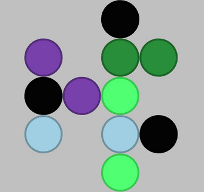
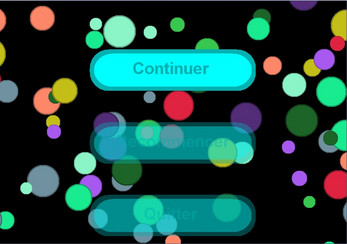
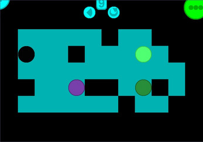
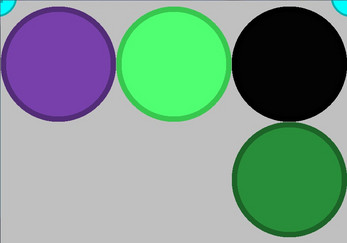
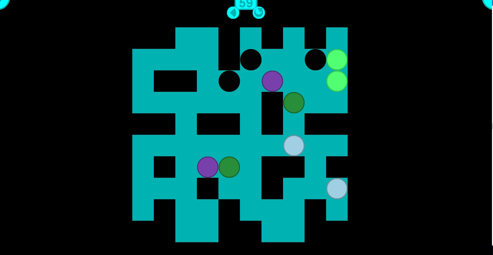

# Atomix NoLimit

## Inspiration 
Jeu inspiré du jeu [Atomix](https://www.abandonware-france.org/ltf_abandon/ltf_jeu.php?id=346) sorti en 1990. Les niveaux sont générés de manière procédurale, tout comme les atomes et les molécules. La difficulté augmente à chaque niveau. Il n'y a pas de fin au jeu.  

## Contrôle
Le jeu se joue uniquement avec la souris.

## Techno
Le jeu a été programmé en java se 6 sans librairie externe. 

## Téléchargement 
Le jar est disponible [ici](https://jonathan-heteau.itch.io/atomix-nolimit).

## Capture d'écran 

